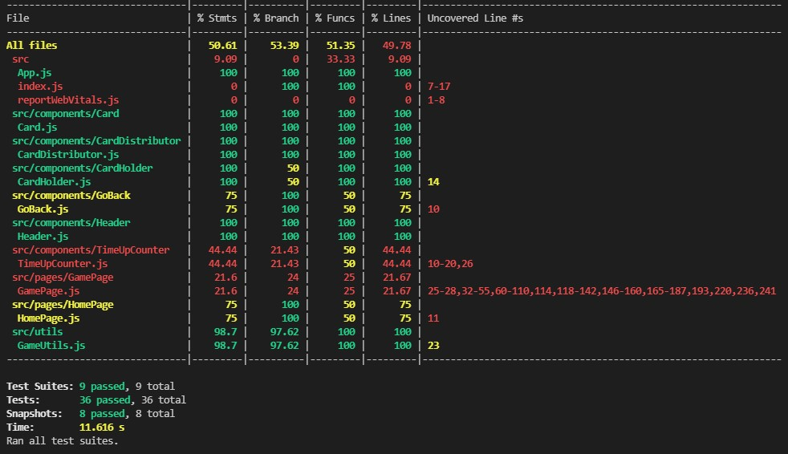
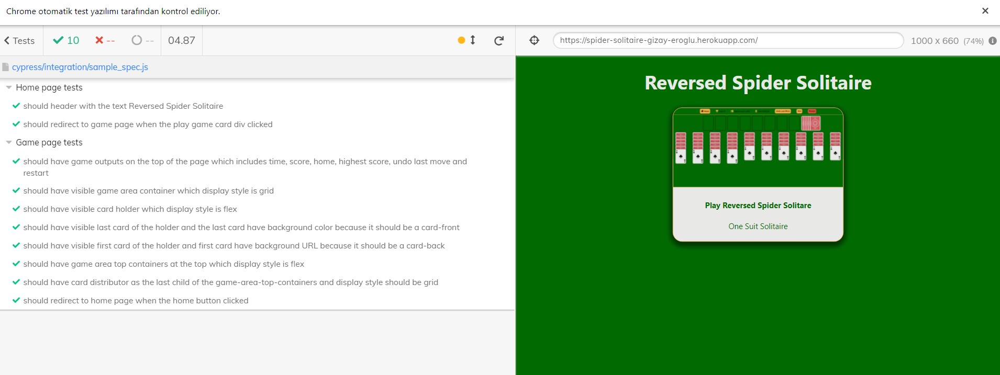

# React Reversed Spider Solitaire

# [Live Demo](https://spider-solitaire-gizay-eroglu.herokuapp.com/)

# Game Preview

# How to play 

You must arrange the cards in order starting with A to K.

You must complete 8 set (A 2 3 4 5 6 7 8 9 10 J Q K) to win the game.

You can only undo the last move you made. If you undo your last move and click again the system will show you the warning message "There is no last move".

If you want to withdraw a card from the distributor, make sure that all holders have cards.

If you need help, you can click to Hint button to see a possible move.

Good Luck !

---
# Available Scripts

In the project directory, you can run:

### `npm install`

### `npm run start`

---
For cypress tests
### `npm run ui-test`

---

# Unit Tests

# UI Tests

