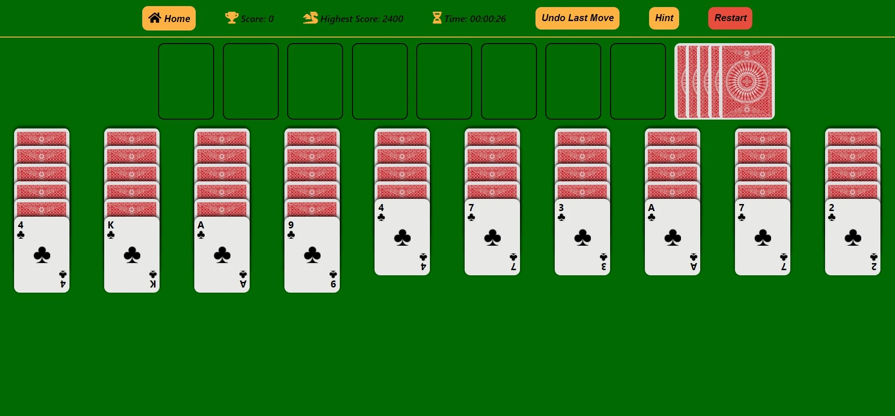

# React Reversed Spider Solitaire

# [Live Demo](https://spider-solitaire-gizay-eroglu.herokuapp.com/)

# Available Scripts

In the project directory, you can run:

### `npm install`

### `npm run start`

Runs the app in the development mode. 
Open [http://localhost:3000](http://localhost:3000) to view it in the browser.

The page will reload if you make edits. 
You will also see any lint errors in the console.

---
# *Reversed Spider Solitaire Desktop*

# *Cypress Tests*

# *Unit Tests*

